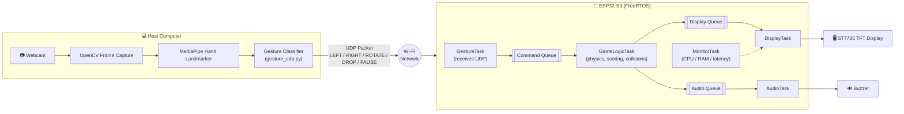
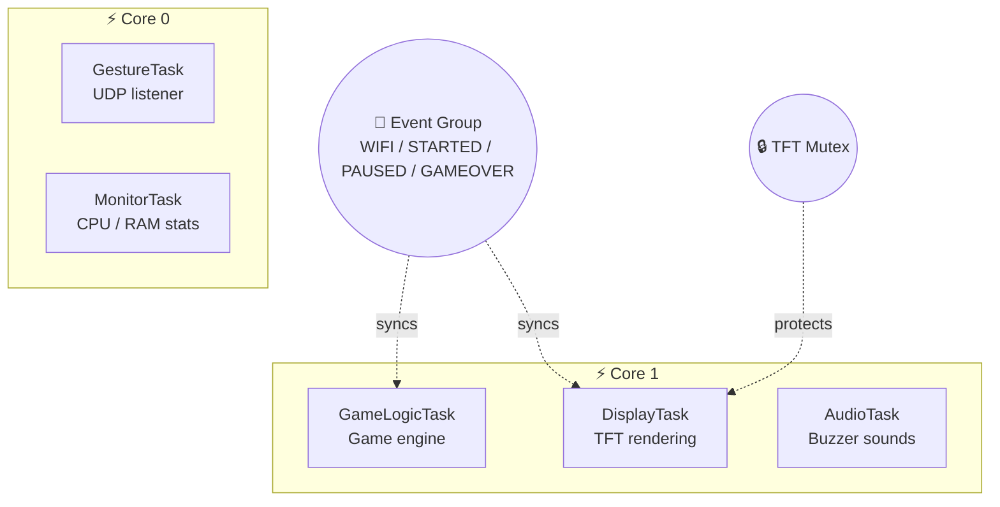
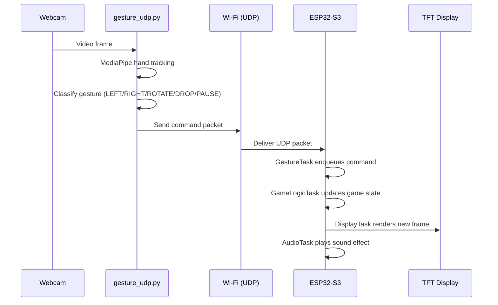
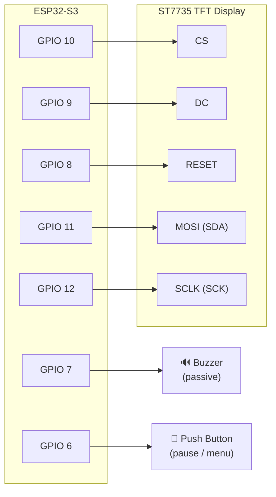

<div align="center">

# 🎮 GestureOS Tetris

**Control a classic Tetris game with your bare hands — no controller, no buttons.**

A real-time hand-gesture-controlled Tetris game running on an ESP32-S3 with FreeRTOS,
powered by a Python + MediaPipe computer vision pipeline over Wi-Fi (UDP).


</div>

---

## 📌 Overview

**GestureOS Tetris** is a CSE323 (Operating Systems) course project that turns a
webcam and an ESP32-S3 microcontroller into a full gesture-controlled gaming console.

A Python script uses **MediaPipe** to track a single hand from a webcam feed,
recognizes 5 distinct gestures, and streams them as lightweight UDP commands to the
ESP32-S3. The ESP32 runs the entire Tetris game engine, physics, scoring, sound, and
graphics rendering on a small **ST7735 TFT display**, using **FreeRTOS** to split the
workload across multiple parallel tasks pinned to both CPU cores.

| Gesture | Action |
|---|---|
| ✋ Open hand (left side) | Move piece **LEFT** |
| ✋ Open hand (right side) | Move piece **RIGHT** |
| ✌️ Two fingers up | **ROTATE** piece |
| ✊ Closed fist | **PAUSE** / Resume game |
| ⬇️ Quick downward hand motion | **HARD DROP** |

---

## 🏗️ System Architecture



The ESP32-S3 firmware runs **five FreeRTOS tasks**, each pinned to a specific core
and synchronized with queues, mutexes, and event groups:

- **`GestureTask`** — receives UDP packets from the Python client and queues game commands
- **`GameLogicTask`** — runs the Tetris physics engine (gravity, collisions, line clears, scoring)
- **`DisplayTask`** — renders the board, pieces, ghost piece, and UI to the TFT screen
- **`AudioTask`** — drives the buzzer for sound effects
- **`MonitorTask`** — tracks live CPU load, RAM usage, and task latency for the on-screen system monitor

### 🔀 FreeRTOS Task & Core Distribution



### 📶 Gesture-to-Command Sequence



---

## ✨ Features

- 🖐️ **Real-time hand gesture recognition** using MediaPipe Hand Landmarker
- 📡 **Wi-Fi UDP control** — no wires needed between the camera and the game console
- ⚙️ **True multitasking** with FreeRTOS — 5 concurrent tasks across 2 CPU cores
- 🎮 **Full Tetris engine** — 7-bag piece randomizer, ghost piece, lock delay, line-clear scoring
- 💾 **Persistent high score** saved to flash (NVS / Preferences)
- 📶 **On-device Wi-Fi manager** — scan, save, and auto-reconnect to networks, all from the TFT screen
- 📊 **Live system monitor** — real-time CPU, RAM, and task latency stats on screen
- 🔊 **Sound effects** via a buzzer, plus a boot animation with course and team credits
- ⏸️ **Pause / Resume** support mid-game via gesture or physical button

---

## 🛠️ Tech Stack

| Layer | Technology |
|---|---|
| Gesture Recognition | Python, OpenCV, MediaPipe (Hand Landmarker) |
| Communication | UDP Sockets over Wi-Fi |
| Firmware / Game Engine | C++ (Arduino framework), FreeRTOS |
| Hardware | ESP32-S3, ST7735 TFT Display, Buzzer, Push Button |
| Graphics | Adafruit GFX + Adafruit ST7735 libraries |

---

## 📂 Repository Structure

```
GestureOS_Tetris/
├── GestureOS_Tetris.ino   # ESP32-S3 firmware — FreeRTOS game engine + display + Wi-Fi
├── gesture_udp.py         # Python gesture-recognition client (OpenCV + MediaPipe)
├── hand_landmarker.task   # Pre-trained MediaPipe hand landmark model
├── LICENSE
└── README.md
```

---

## ⚙️ Hardware Requirements

- ESP32-S3 development board
- ST7735 TFT display (128×160, black tab)
- Passive buzzer
- Push button (for manual pause / menu control)
- A webcam-equipped computer on the **same Wi-Fi network** as the ESP32-S3

### 🔌 Pin Mapping Diagram



| Component | ESP32-S3 Pin | Function |
|---|---|---|
| TFT CS | GPIO 10 | Chip Select |
| TFT DC | GPIO 9 | Data / Command |
| TFT RST | GPIO 8 | Reset |
| TFT MOSI | GPIO 11 | SPI Data (SDA) |
| TFT SCLK | GPIO 12 | SPI Clock |
| Buzzer | GPIO 7 | Digital Output |
| Button | GPIO 6 | Digital Input (Interrupt) |

---

## 🚀 Getting Started

### 1. Flash the ESP32-S3 firmware

1. Open `GestureOS_Tetris.ino` in the **Arduino IDE**.
2. Install the required libraries via Library Manager:
   - `Adafruit GFX Library`
   - `Adafruit ST7735 and ST7789 Library`
3. Select your ESP32-S3 board under **Tools → Board**.
4. Upload the sketch.
5. On boot, use the on-screen Wi-Fi manager to scan and connect to your network.
   The device's IP address will be printed to the Serial Monitor (115200 baud).

### 2. Run the Python gesture client

Install the dependencies:

```bash
pip install opencv-python mediapipe
```

Update the ESP32's IP address in `gesture_udp.py`:

```python
ESP32_IP = "192.168.0.112"   # <-- replace with your ESP32's IP
ESP32_PORT = 4210
```

Then run:

```bash
python gesture_udp.py
```

A camera window will open. Show your hand to start playing — press **Q** to quit.

---

## 🎥 Demo


---

## 🧠 Operating Systems Concepts Applied

This project was built for **CSE323 – Operating Systems** and demonstrates:

- **Multitasking / Concurrency** — 5 FreeRTOS tasks running in parallel
- **Task Scheduling** — tasks pinned to specific cores with defined priorities
- **Inter-Process Communication (IPC)** — FreeRTOS queues used to pass commands and game state between tasks
- **Synchronization** — mutexes protect shared TFT access; event groups coordinate game state across tasks
- **Interrupt Handling** — hardware ISR for the physical pause button
- **Networking** — UDP socket-based inter-process communication between the Python host and embedded firmware

---

## 👥 Contributors — CSE323.7, Group 8

| Name | Student ID |
|---|---|
| Tarif Bin Mehedi | 2221265042 |
| Sabiha Binte Siraj | 2222633042 |
| Sabbir Ahmed | 2222322642 |

---

## 📄 License

This project is licensed under the terms of the [LICENSE](LICENSE) file included in this repository.

<div align="center">

Made with ❤️, FreeRTOS, and a lot of hand-waving 🖐️

</div>